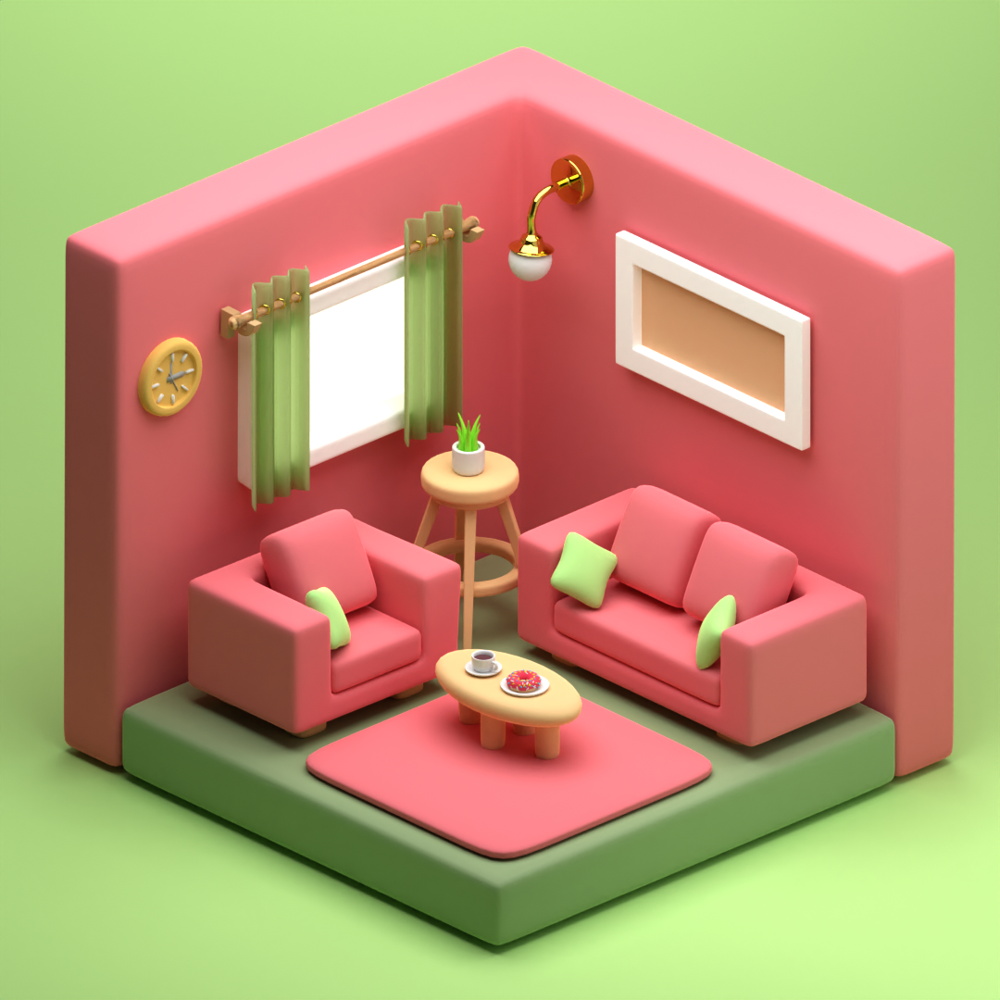

# Living Room 3D Model

This repository contains a 3D model of a living room created using Blender. The purpose of this project was to design a realistic living room environment with attention to detail and aesthetics.

## Features

- **Realistic Design**: The living room is meticulously designed to resemble a modern and cozy space with carefully chosen furniture and decor elements.
- **High-Quality Textures**: The model utilizes high-quality textures to enhance the realism and visual appeal of the scene.
- **Lighting Setup**: The lighting setup is optimized to create a warm and inviting ambiance within the living room.
- **Multiple Views**: The model includes various camera views, allowing you to explore the living room from different angles.

## Usage

To explore the 3D model, you'll need to have Blender installed on your computer. Follow these steps:

1. Clone this repository to your local machine.
2. Open Blender and navigate to `File > Open`.
3. Browse to the location where you cloned the repository and select the `living_room.blend` file.
4. Once the project is loaded, you can switch between camera views to explore the living room in detail.

Feel free to use this 3D model for personal projects, educational purposes, or as a starting point for your own designs. If you have any questions or suggestions, please don't hesitate to create an issue or reach out to me.

Happy exploring!

